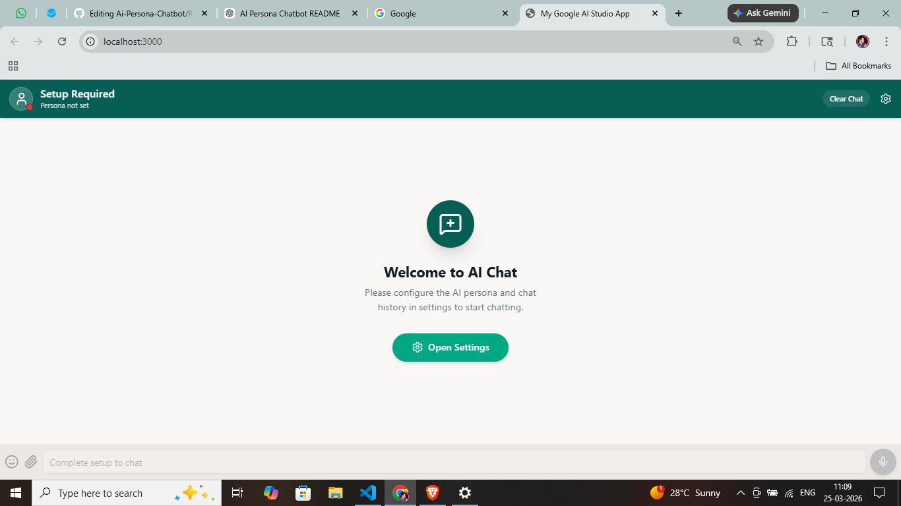
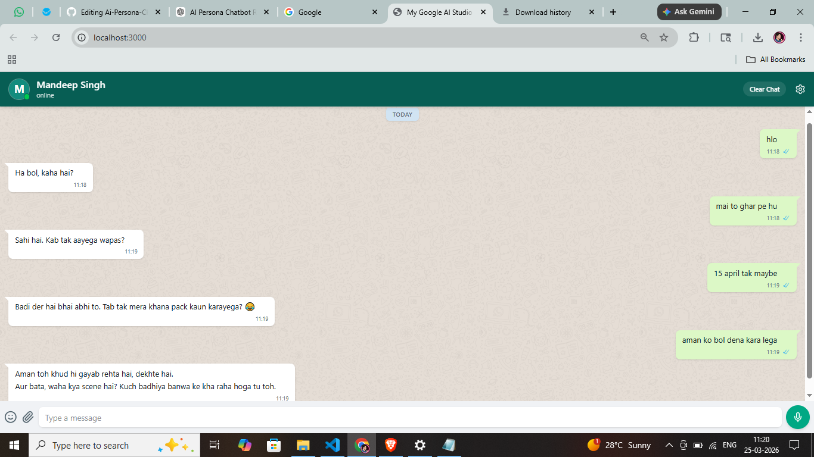
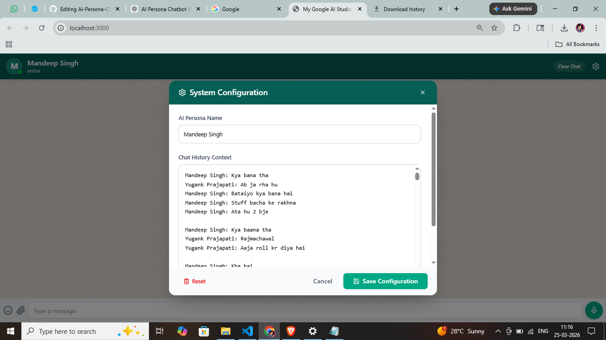

<h1 align="center">🚀 AI Persona Chatbot</h1>

An AI-powered chatbot that simulates <b>human-like personalities</b> using LLMs and prompt engineering.

  
  
  
  

---

<h2>✨ Features</h2>

<ul>
  <li>🎭 Persona-based conversations</li>
  <li>🧠 Smart prompt engineering</li>
  <li>⚡ Real-time chat interface</li>
  <li>🔄 Dynamic persona switching</li>
  <li>🧩 Modular architecture</li>
</ul>

---

<h2>📸 Screenshots</h2>

  
  

  

---

<h2>🏗️ Tech Stack</h2>

<ul>
  <li><b>Frontend:</b> React.js, HTML, CSS, JavaScript</li>
  <li><b>Backend:</b> Node.js, Express</li>
  <li><b>AI Integration:</b> OpenAI API</li>
</ul>

---

<h2>📂 Project Structure</h2>

<pre>
Ai-Persona-Chatbot/
│
├── assets/
│   └── screenshots/
│       ├── Screenshot (457).png
│       ├── Screenshot (458).png
│       └── Screenshot (459).png
│
├── Backend/
├── Frontend/
├── persona-Hitesh/
└── README.md
</pre>

---

<h2>⚙️ Installation</h2>

<h3>1. Clone Repository</h3>

<pre>
git clone https://github.com/yugank2002/Ai-Persona-Chatbot.git
cd Ai-Persona-Chatbot
</pre>

<h3>2. Setup Backend</h3>

<pre>
cd Backend
npm install
npm run dev
</pre>

<h3>3. Setup Frontend</h3>

<pre>
cd ../Frontend
npm install
npm run dev
</pre>

<h3>4. Environment Variables</h3>

<pre>
GEMINI_API_KEY
</pre>

---

<h2>🧠 How It Works</h2>

<ol>
  <li>User sends a message via the UI</li>
  <li>Backend processes the request</li>
  <li>Persona-specific prompt is injected</li>
  <li>OpenAI generates the response</li>
  <li>Response is returned in persona style</li>
</ol>

---

<h2>🎭 Example Persona</h2>

<b>xyz Singh Style</b>

<ul>
  <li>Friendly and engaging tone</li>
  <li>Explains concepts step-by-step</li>
  <li>Uses real-world examples</li>
</ul>

---

<h2>🚀 Future Improvements</h2>

<ul>
  <li>🔊 Voice-based interaction</li>
  <li>🧠 Long-term memory</li>
  <li>🎭 Multiple persona support in UI</li>
  <li>📊 Chat analytics dashboard</li>
</ul>

---

<h2>🤝 Contributing</h2>

<ol>
  <li>Fork the repository</li>
  <li>Create a new branch</li>
  <li>Make your changes</li>
  <li>Submit a pull request</li>
</ol>

---

<h2 align="center">👨‍💻 Author</h2>

<b>Yugank</b> 
Computer Science Student

